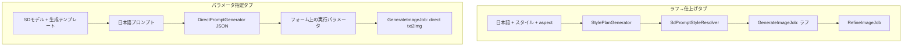

# パラメータ指定タブ — 画像生成設計

画像生成画面（`/image_generations/new`）の **パラメータ指定** タブ向け設計。
**ラフ→仕上げ** タブ（既存の style 計画パイプライン）とは別系統とし、ユーザーが **SD モデルを直接選び**、**プロンプト生成テンプレート**（システムプロンプト）で正/ネガティブプロンプトを生成してから、解像度・Steps 等を指定して **1 発 txt2img** する。

- **ステータス:** 設計（2026-07）
- **関連:** [prompt-architecture-redesign.md](../prompt-architecture-redesign.md)、徒然 `docs/architecture/chat-agent-roadmap.adoc` §12（Agent Chat refine 接続済み）
- **UI たたき台:** `image_generations/new` の 2 タブ（ラフ→仕上げ / パラメータ指定）。パラメータ側はラフ生成カード除去のみ、**バックエンド未接続**

---

## 1. 背景と目的

### 1.1 既存フロー（ラフ→仕上げ）の前提

| 要素 | 実装 |
|------|------|
| 画風・LoRA・モデル | `PromptStyle` + `SdPromptStyleResolver` |
| 日本語→英語 | `StylePlanGenerator`（`style_id` + `subject_prompt` + `negative_extra`） |
| 生成 | ラフ複数枚 → 案選択 → `RefineImageJob`（img2img + 任意 Hires） |

スタイルが「見た目」とモデル選択を束ねるため、**モデルごとのプロンプト作法をユーザーが明示的に選ぶ**用途には向かない。

### 1.2 パラメータ指定タブの目的

- **スタイル選択なし** — `PromptStyle` / RAG style 計画を通さない
- **画像生成モデルを先に選ぶ** — `SdModelProfile` を UI で指定
- **モデル（またはファミリ）ごとのプロンプト生成テンプレート** — LLM の system prompt を CRUD で管理（例: 日本語 → SD 3.5 最適化プロンプト）
- **1 回の LLM 呼び出し** で `prompt` と `negative_prompt` を JSON 取得（方針 **B**）
- **実行パラメータを細かく指定** — width/height/steps/cfg/sampler/hires 等（`default_params` を初期値）

---

## 2. 2 タブの責務分界



| | ラフ→仕上げ | パラメータ指定 |
|---|------------|----------------|
| `generation_flow` | `draft`（既定） | `direct` |
| スタイル | あり | **なし** |
| モデル決定 | style 経由 | **ユーザー選択 `sd_model_profile_id`** |
| 日本語→SDプロンプト | StylePlanGenerator | **DirectPromptGenerator + SdPromptTemplate** |
| 生成パイプライン | draft → refine | **txt2img 1 発（+ 任意 Hires）** |

---

## 3. ユーザーフロー（パラメータ指定）

1. **画像生成モデル**を選択（`SdModelProfile.enabled`）
2. **プロンプト生成テンプレート**を確認（モデルに紐づく既定、またはファミリ/グローバル既定。必要なら上書き選択）
3. **日本語プロンプト**を入力
4. **プロンプト生成**ボタン → LLM が JSON で `prompt` / `negative_prompt` を返す → フォームに挿入
5. **実行パラメータ**（width, height, steps, cfg_scale, sampler, vae_tiling, hires 等）を調整
6. **生成する** → 非同期ジョブ → 完了画像を `refined_images`（または `image`）に保存

生成時に日本語のみで SD プロンプトが空の場合は、ジョブ内で同じ生成経路を自動実行する。

---

## 4. プロンプト生成テンプレート（SdPromptTemplate）

> **命名（2026-07）**  
> 実態は「日本語の逐語訳」ではなく **ターゲット SD モデル/family に最適化した正/ネガプロンプトの生成指針（system prompt）** である。  
> コード名 **`SdPromptTemplate`**、UI **プロンプト生成テンプレート**（ナビ略称: 生成テンプレート）。

### 4.0 なぜ「翻訳スキル」ではないか

| 観点 | 翻訳スキル（旧称）の問題 | 生成テンプレート（推奨） |
|------|-------------------------|------------------------|
| 処理の実態 | 「翻訳」と誤解されやすい | **生成** — モデル作法に沿った prompt / negative_prompt の組み立て |
| 出力 | 英訳 1 本を連想 | JSON 2 フィールド（正 + ネガ）。タグ列・品質タグ・文体は family 依存 |
| 名前の例 | 「Pony 翻訳」 | **「日本語 → Pony XL 最適化プロンプト」** / 短縮 **「Pony XL 向け」** |
| 既存語との衝突 | 削除済み `PromptSkill`、`InpaintNoteTranslator#translation_skill` と紛らわしい | `SdModelProfile` / `SdPromptTranslator` と同系の **Sd\*** 命名 |

inpaint の `PromptKnowledgeChunk`（部分修正翻訳）は **マスク領域の断片**向けでフロー固定。パラメータ指定は **txt2img 全文**向けの **モデル別テンプレート CRUD** として別概念のまま維持する。

### 4.1 スキーマ

```ruby
create_table :sd_prompt_templates do |t|
  t.string  :name, null: false                 # 表示名（例: SD 3.5 向け）
  t.text    :body, null: false                 # システムプロンプト（可変部分）
  t.string  :family                            # nullable — ファミリ既定（sd15/sdxl/pony/...）
  t.references :sd_model_profile, foreign_key: true, null: true  # nullable — モデル専用
  t.boolean :enabled, null: false, default: true
  t.integer :sort_order, null: false, default: 0
  t.text    :notes
  t.timestamps
end
```

- **`name`** — UI 表示名。推奨パターン: `{ファミリ/モデル} 向け` または `日本語 → {ターゲット} 最適化プロンプト`。
- **`body`** — LLM への **システムプロンプト（可変部分）**。タグ列 vs 自然文、品質タグの有無、`negative_prompt` の作法など **モデル/family 固有の指針**を書く。
- **ネガティブも LLM が JSON で返す**（方針 B）ため、`default_negative_prompt` 列は **持たない**（固定ネガが必要なら `body` 内で「negative_prompt には常に X を含めよ」と指示する）。

### 4.2 解決順位

`SdPromptTemplateResolver.for(sd_model_profile:)`:

1. `sd_model_profile_id` が一致する **enabled** テンプレート（sort_order 昇順で先頭）
2. なければ `family` がモデルの `family` と一致するテンプレート
3. なければ `family` / `sd_model_profile_id` が両方 null の **グローバル既定**（`sort_order` 最小の 1 件）

seed でファミリ別のたたき台（Pony タグ列、Flux 自然文、SD 3.5 等）を用意する。

**seed 名の例:**

| family | name（推奨） |
|--------|-------------|
| sd35 | SD 3.5 向け |
| pony | Pony XL 向け |
| flux | Flux 向け |
| krea2 | Krea2 向け |
| — | グローバル既定 |

### 4.3 CRUD

| 項目 | 内容 |
|------|------|
| ルート | `resources :sd_prompt_templates` |
| コントローラ | 一覧 / 新規 / 編集 / 有効化。`body` は **システムプロンプト** textarea |
| ナビ | 設定系（`SdModelProfiles` 近傍）に **「生成テンプレート」**（正式名: プロンプト生成テンプレート） |
| モデル編集 | `sd_model_profiles/show` から当該モデル用テンプレートへの導線 |

---

## 5. LLM 契約 — 方針 B（JSON 1 回）

### 5.1 出力 JSON

LLM は **次の 2 フィールドのみ**を返す。実行パラメータ（width/steps/model 等）は **サーバ側**が `SdModelProfile` + フォームから解決する（[prompt-architecture-redesign.md](../prompt-architecture-redesign.md) の原則 1–2 と同様）。

```json
{
  "prompt": "masterpiece, best quality, 1girl, ...",
  "negative_prompt": "low quality, worst quality, blurry, ..."
}
```

| フィールド | 意味 |
|------------|------|
| `prompt` | txt2img 正プロンプト（英語） |
| `negative_prompt` | txt2img ネガティブプロンプト（英語） |

### 5.2 JSON Schema（`DirectPromptJsonSchema`）

`StylePlanJsonSchema` と同パターン。llama-server が `response_format` + `json_schema` をサポートする接続でのみ付与する。

```ruby
# app/services/direct_prompt_json_schema.rb（新規）
{
  type: "json_schema",
  json_schema: {
    name: "direct_prompt",
    strict: true,
    schema: {
      type: "object",
      properties: {
        prompt: { type: "string" },
        negative_prompt: { type: "string" }
      },
      required: %w[prompt negative_prompt],
      additionalProperties: false
    }
  }
}
```

### 5.3 System prompt の構成

実効的な system prompt は次を連結する。

1. **固定プレフィックス（コード）** — 「日本語の画像説明から、指定モデル向けの SD プロンプトを生成せよ。出力は JSON のみ。`prompt` と `negative_prompt` を返せ。」
2. **`SdPromptTemplate#body`** — モデル/family 固有の作法（例: Pony では `score_9` 系、Flux では自然文短句、SD 3.5 では読みやすい句、など）

`StylePlanPrompts` のように **可変部分だけ DB、契約部分はコード**に分離する。

### 5.4 パースとエラー

- 応答は `LlamaJsonParser.parse`（既存）でパース
- 空フィールド・JSON 崩れは `DirectPromptGenerator::Error` として UI / ジョブに返す
- `response_format` 非対応の接続では schema なし + プロンプト内 JSON 指示にフォールバック（`StylePlanGenerator` と同様）

---

## 6. サービス層

### 6.1 `DirectPromptGenerator`（新規）

```ruby
# 擬似 API
DirectPromptGenerator.new(
  client: StylePlanModelCatalog.client_for(connection_key:),
  connection_key: nil  # または image_generation 用の既定接続
).generate(japanese_prompt, sd_model_profile:)
# => { prompt: "...", negative_prompt: "..." }
```

処理:

1. `template = SdPromptTemplateResolver.for(sd_model_profile:)`
2. `system = DirectPromptGenerator.build_system_prompt(template)`
3. `client.chat(messages: [...], response_format: DirectPromptJsonSchema.build, ...)`
4. `LlamaJsonParser.parse` → キー検証 → Hash 返却

既存 `SdPromptTranslator`（正プロンプトのみ・`body` 差し替え）は **inpaint 専用のまま温存**。パラメータ指定は **別クラス**とし、責務境界を保つ。

### 6.2 `SdPromptTemplateResolver`（新規）

`SdModelProfile` から §4.2 の順で `SdPromptTemplate` を 1 件返す。

### 6.3 生成ジョブ（`GenerateImageJob` 拡張）

`generation_flow == "direct"` の分岐:

```text
preparing
  → generating_prompt（japanese のみで prompt 空のとき DirectPromptGenerator）
  → switch_model（SdModelProfile.switch_key）
  → refining（ステータスラベルは「生成中」。実処理は txt2img）
  → completed
```

- `persist_resolved!` に相当する処理: 選択モデルの `resolved_default_params` + フォーム値を `ImageGeneration` に保存
- `SdCppClient#txt2img` を **本番 width/height** で 1 回。`enable_hr` はフォームの `enable_hires` に従う
- 結果は `refined_images` に attach（`metadata: { direct: true, sequence: 1 }`）
- **ラフ案・`awaiting_selection`・`RefineImageJob` は通さない**

---

## 7. データモデル拡張（ImageGeneration）

| 列 / 概念 | 用途 |
|-----------|------|
| `generation_flow` | `draft` \| `direct` |
| `sd_model_profile_id` | direct 時のモデル（FK、nullable） |
| `sd_prompt_template_id` | 任意。UI で上書き選択したテンプレート（監査・再現用） |

direct 時のバリデーション:

- `style_id` は **不要**（`style_flow?` を direct では緩和、または `sd_model_profile` 必須に切替）
- `sd_model` / `loras` はモデルプロファイル + フォームからサーバが埋める

既存 `resolved_params` / `resolved_negative_prompt` にスナップショットを保存し、再生成（`copy_from`）で再現可能にする。

---

## 8. HTTP API

### 8.1 フォーム用プロンプト生成（パラメータタブ用）

```
POST /image_generations/generate_prompt_direct
```

| パラメータ | 必須 | 説明 |
|------------|------|------|
| `japanese_prompt` | ✓ | 日本語入力 |
| `sd_model_profile_id` | ✓ | 選択モデル |
| `sd_prompt_template_id` | | 上書きテンプレート（省略時は Resolver 既定） |
| `style_plan_connection_key` | | LLM 接続（既存 translate と同様） |

応答:

```json
{
  "prompt": "...",
  "negative_prompt": "..."
}
```

既存 `translate_prompt`（style 計画用）は **ラフ→仕上げタブ専用**のまま残す。

### 8.2 作成

`POST /image_generations` に `generation_flow: direct` と `sd_model_profile_id` 等を含める。`create` は flow に応じて `apply_render_presets!`（draft のみ）をスキップ。

---

## 9. UI（パラメータ指定タブ）

`_form_body`（`include_draft: false`）を本設計用に差し替え。

| ブロック | 内容 |
|----------|------|
| モデル | `collection_select` — `SdModelProfile.enabled.ordered` |
| 生成テンプレート | 解決結果の表示名 + 任意で上書き select |
| 日本語 | `japanese_prompt`（required） |
| SD プロンプト | `prompt` + 生成結果の挿入/置換（`generate_prompt_direct`） |
| ネガティブ | `negative_prompt` + 生成結果の挿入/置換（同一 API の一括結果） |
| 実行 | width/height/steps/cfg/sampler/vae_tiling + Hires カード |
| 送信 | 「生成する」 |

**非表示:** `style_id`、`style_plan_connection`（LLM 接続はアプリ設定または折りたたみで可）、ラフ生成カード、本番仕上げ（img2img denoise）— direct では refine 設定は使わない。

Stimulus: `image-generation-form` を拡張し、パラメータタブでは `generate_prompt_direct` URL と `sd_model_profile_id` を POST に含める。

---

## 10. 既存コードとの関係

| コンポーネント | パラメータ指定での扱い |
|----------------|------------------------|
| `StylePlanGenerator` | **不使用** |
| `SdPromptStyleResolver` | **不使用** |
| `SdPromptTranslator` | inpaint のみ継続使用 |
| `SdModelProfile` | **中心**。選択・`default_params`・`switch_key` |
| `PromptStyle` | 不使用 |
| `RenderPreset` | draft/refine 用。direct では Hires フィールドをフォーム直指定 |
| `InpaintNoteTranslator` | 変更なし（別 skill 解決） |

---

## 11. 実装フェーズ

| Phase | 内容 | 成果物 |
|-------|------|--------|
| **0** | 本設計書 | このドキュメント |
| **1** | 生成テンプレート CRUD | `SdPromptTemplate`, controller, views, seed |
| **1.1** | 命名リネーム | `translation_skills` → `sd_prompt_templates`（完了） |
| **2** | LLM 契約 | `DirectPromptJsonSchema`, `SdPromptTemplateResolver`, `DirectPromptGenerator`, tests（完了） |
| **3** | 生成 API + UI | `generate_prompt_direct`, パラメータタブフォーム, Stimulus（完了） |
| **4** | 直接生成 | `generation_flow`, `GenerateImageJob#generate_direct`, status panel（完了） |
| **5** | MCP / 徒然 Agent Chat | `list_image_generation_options` + `generate_image` の direct オプション（完了） |

各 Phase 末で `bin/rails test` と UI から 1 件生成の手動確認。

---

## 12. 未決事項

| # | 論点 | 推奨 |
|---|------|------|
| 1 | direct 時の LoRA | 初期は **モデル `default_params` のみ**。UI で LoRA 追加は Phase 5 以降 |
| 2 | LLM 接続 | `StylePlanModelCatalog` 既定を流用。パラメータタブ専用接続は不要（当面） |
| 3 | `refined_images` vs `image` | ラフタブと揃え **`refined_images`** に統一 |
| 4 | 生成テンプレートとナレッジ chunk | 統合しない。inpaint chunk とは別テーブルで明確化 |
| 5 | 徒然 Agent Chat refine | 徒然 `chat-agent-roadmap.adoc` §12 の通り別途。direct 生成の MCP 公開は完了 |

---

## 13. 関連ファイル（実装時の起点）

| 領域 | パス |
|------|------|
| UI たたき台 | `app/views/image_generations/new.html.slim`, `_form_body.html.slim` |
| 既存翻訳（style） | `app/controllers/image_generations_controller.rb#translate_prompt` |
| JSON Schema 先例 | `app/services/style_plan_json_schema.rb` |
| モデル CRUD | `app/controllers/sd_model_profiles_controller.rb` |
| inpaint 翻訳先例 | `app/services/inpaint_note_translator.rb`, `sd_prompt_translator.rb` |
| 生成ジョブ | `app/jobs/generate_image_job.rb` |
