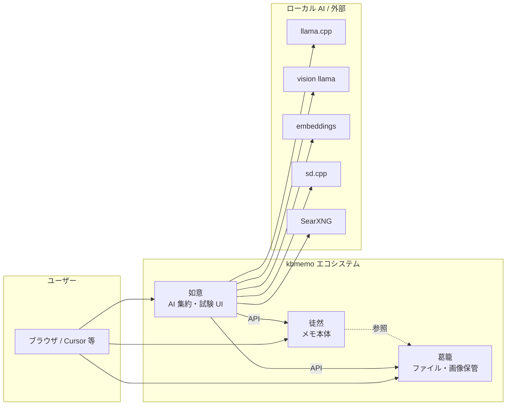
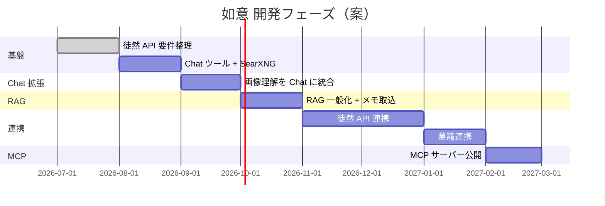

# kbmemo エコシステム — 現状・方針・ロードマップ

徒然（メモ）・葛籠（ファイル保管）・如意（AI 集約）の 3 アプリ構成と、如意を MCP サーバーとしても活用する方針を整理する。

---

## 1. 全体構成

| アプリ | URL（想定） | 読み / コード名 | 役割 |
|--------|-------------|----------------|------|
| **徒然** | kbmemo.net | tsuredure / `Tsurezure` | メモの正本。作成・編集・閲覧・検索 |
| **葛籠** | media.kbmemo.net（現行） | tsuzura | ファイル・画像の保管庫。バイナリの正本 |
| **如意** | nyoy.kbmemo.net | nyoy | AI 機能の集約、各機能の試験 UI、将来は MCP サーバー |

- 徒然リポジトリ: [gitea.artif.org/Artif.org/kbmemo_site](https://gitea.artif.org/Artif.org/kbmemo_site)（ローカル `~/work/kbmemo`）
- 葛籠は同一モノレポ内の `kbmemo-media/`。本番は現状 `media.kbmemo.net`

ローマ字表記の詳細は [徒然 API 要件 §0](./tsuredure-api-requirements.md#0-名称ローマ字表記) を参照。



### 設計原則

1. **正本の分離** — メモは徒然、バイナリは葛籠。如意は AI 処理とオーケストレーションに専念する。
2. **ツール層の共有** — Chat ツールと MCP ツールは同じ実装を使い回す。
3. **接続の一元管理** — 外部 AI サービスは `ServiceConnection` + `NyoyConnectionStore` 経由。
4. **試験 UI を如意に置く** — 画像生成・Chat など各 AI 機能は如意で先に試し、成熟したら他アプリや MCP から呼ぶ。

---

## 2. 如意（Nyoy）の現状

### 2.1 概要

日本語テキストから Stable Diffusion 画像を生成する Rails 8.1 アプリ。  
llama.cpp で `style_id` ベースの最小 JSON 計画を作成し、`SdPromptStyleResolver` で実行設定を解決して sd.cpp で txt2img を実行する。

**スタック:** Rails 8.1, PostgreSQL + pgvector, Solid Queue/Cache/Cable, Hotwire, Slim, Vite, `ruby_llm` gem。

### 2.2 機能一覧

| 機能 | ルート / モデル | 状態 |
|------|----------------|------|
| メモ挿絵 | `memo_illustrations` | 運用中 |
| 画像生成（draft → 選択 → refine） | `image_generations` | 運用中 |
| img2img | `img2img_generations` | 運用中 |
| 部分修正（inpaint） | `memo_illustrations#inpaint` | 運用中 |
| 画像理解 | `image_understandings` + `VisionChatService` | 運用中（独立 UI） |
| プロンプトナレッジ CRUD | `prompt_knowledge_chunks` | 運用中 |
| Chat | `chats` / `messages` | 運用中（テキストのみ） |
| 接続管理 | `service_connections` | 運用中 |
| MCP サーバー | — | **未実装** |
| 徒然・葛籠連携 | — | **未実装** |

### 2.3 接続管理（ServiceConnection）

組み込みバックエンド 6 種を DB で管理。環境変数へのフォールバックあり。

| key | 用途 |
|-----|------|
| `llama_cpp` | テキスト LLM（style 計画、Chat 等） |
| `gpt_oss` | テキスト LLM（GPT-OSS 系、Chat） |
| `vision_llama` | 画像理解 |
| `embeddings` | bge-m3 埋め込み |
| `sd_cpp` | sd.cpp 画像生成 |
| `sd_switchd` | SD モデル切り替え |

Chat バックエンド保存時に `ChatModelCatalog.seed!` で `Model` レコードを同期する。

### 2.4 Chat

- `ruby_llm` の `acts_as_chat` / `acts_as_message` / `acts_as_model`
- `ChatResponseJob` が `chat.ask` を実行し、Turbo Stream でストリーミング
- `ChatModelCatalog.context_for` で llama.cpp の OpenAI 互換 API に接続
- `ToolCall` モデルは存在するが **ツール未配線**

### 2.5 RAG

- `PromptKnowledgeChunk` — pgvector + `neighbor` gem
- kind: style / model / lora / negative / composition / camera / lighting / inpaint
- `PromptKnowledgeRetriever` が cosine 近傍検索
- **画風プロンプト専用**。メモ RAG は未対応

### 2.6 外部連携の現状

| 連携先 | 状態 |
|--------|------|
| llama.cpp / sd.cpp / embeddings | HTTP（ServiceConnection 経由） |
| SearXNG（bowmore.artif.org:8080） | **未接続** |
| 徒然（kbmemo.net） | **未接続**（UI テーマのみ KBMemo 互換）。徒然側は `POST /api/clips` のみ API あり |
| 葛籠（media.kbmemo.net） | **未接続**（徒然 UI から内部 API 経由で利用） |
| MCP | **未実装** |

---

## 3. 今後の方針

### 3.1 如意の位置づけ

- **AI ハブ** — ローカル LLM / SD / embeddings / 検索を束ね、徒然・葛籠・MCP クライアントから利用可能にする
- **試験場** — 新 AI 機能は如意 UI で先に検証し、安定後にツール化・MCP 化
- **RAG 管理** — プロンプトナレッジに加え、徒然メモ由来のナレッジも取り込み・検索可能にする

### 3.2 Chat に追加したい機能

| 機能 | 概要 | 依存 |
|------|------|------|
| Web 検索 | SearXNG（bowmore.artif.org:8080）経由 | ServiceConnection 追加 |
| URL データ取得 | 指定 URL の HTML / テキスト抽出 | SSRF 対策必須 |
| 画像理解 | 添付画像または葛籠 URL から分析 | `VisionChatService` 統合 |
| 徒然メモ書き出し | Chat 結果を徒然に保存 | **徒然 API** |
| 徒然メモ書き支援 | 徒然の下書きを読み、推敲・追記 | **徒然 API** |
| メモ RAG 生成 | 徒然メモから embedding チャンクを生成 | **徒然 API** + RAG 一般化 |

### 3.3 ツール層アーキテクチャ（目標）

```
Chat UI ──┐
          ├── ChatTools::* ── ServiceConnection / 徒然 API / 葛籠 API
MCP Server ┘
```

Chat と MCP で同じツール実装を共有する。`ChatResponseJob` に `with_tool` を配線し、MCP は JSON-RPC ハンドラから同一クラスを呼ぶ。

### 3.4 RAG 拡張方針

現行 `PromptKnowledgeChunk` に `source` 列（`prompt` / `memo` / `url` 等）を追加し、スコープで分離する案を第一候補とする。

- プロンプト用: 既存 kind（style, lora, inpaint 等）
- メモ用: 徒然メモ ID・タイトル・本文チャンク
- 管理 UI: タブまたはフィルタで source 別表示

### 3.5 MCP サーバー化

如意が提供する MCP ツール候補（Chat ツールと共用）:

| ツール | 由来 |
|--------|------|
| `web_search` | SearXNG |
| `fetch_url` | 新規 |
| `analyze_image` | `VisionChatService` |
| `search_knowledge` | RAG |
| `search_memos` / `create_memo` / `update_memo` | 徒然 API |
| `generate_image` 等 | 既存 SD パイプライン（将来） |

実装: HTTP/SSE ベース（`nyoy.kbmemo.net/mcp`）。認証は API トークン。

---

## 4. 段階的ロードマップ

| Phase | 内容 | 主な成果物 | 依存 |
|-------|------|-----------|------|
| **0** | 徒然 API 要件整理 | `docs/tsuredure-api-requirements.md`（現状調査済み） | — |
| **1** | Chat ツール基盤 + Web 検索 + URL 取得 | `ChatTools::*`, SearXNG 接続 | — |
| **2** | Chat への画像理解統合 | メッセージ添付 / 葛籠 URL | Phase 1 |
| **3** | RAG 一般化 + メモ取込 | `source` 拡張, 取込ジョブ | 徒然 API（読取） |
| **4** | 徒然 API 連携 | メモ CRUD ツール, 書き支援 | 徒然 API（読書） |
| **5** | 葛籠連携 | 生成物保管, Chat から画像参照 | 葛籠 API |
| **6** | MCP サーバー公開 | `/mcp` エンドポイント | Phase 1–4 |



---

## 5. 未決事項

| # | 論点 | 影響 |
|---|------|------|
| 1 | 徒然 API の認証方式（API キン / OAuth / セッション共有） | 如意・MCP 双方 |
| 2 | 葛籠への画像移行タイミング（ActiveStorage のまま vs 葛籠正本） | 生成物の保管 |
| 3 | メモ RAG の更新方式（webhook / 定期 sync / 手動） | 鮮度・運用コスト |
| 4 | Chat モデル切替（テキスト vs vision を会話中で切替 vs vision 一本化） | UX・実装 |
| 5 | MCP 利用者（Cursor のみ vs 徒然からも呼ぶ） | 認可設計 |

---

## 6. 関連ドキュメント

- [徒然（tsuredure）API 要件](./tsuredure-api-requirements.md) — 如意から見た徒然 API の要求仕様・現状調査（Phase 0 完了）
- [徒然 API OpenAPI 草案](./openapi/kbmemo-v1.yaml) — `kbmemo-v1.yaml`
- [徒然リポジトリ](https://gitea.artif.org/Artif.org/kbmemo_site) — kbmemo_site
- [プロンプト設計 再構築案](./prompt-architecture-redesign.md) — SD プロンプトアーキテクチャ
