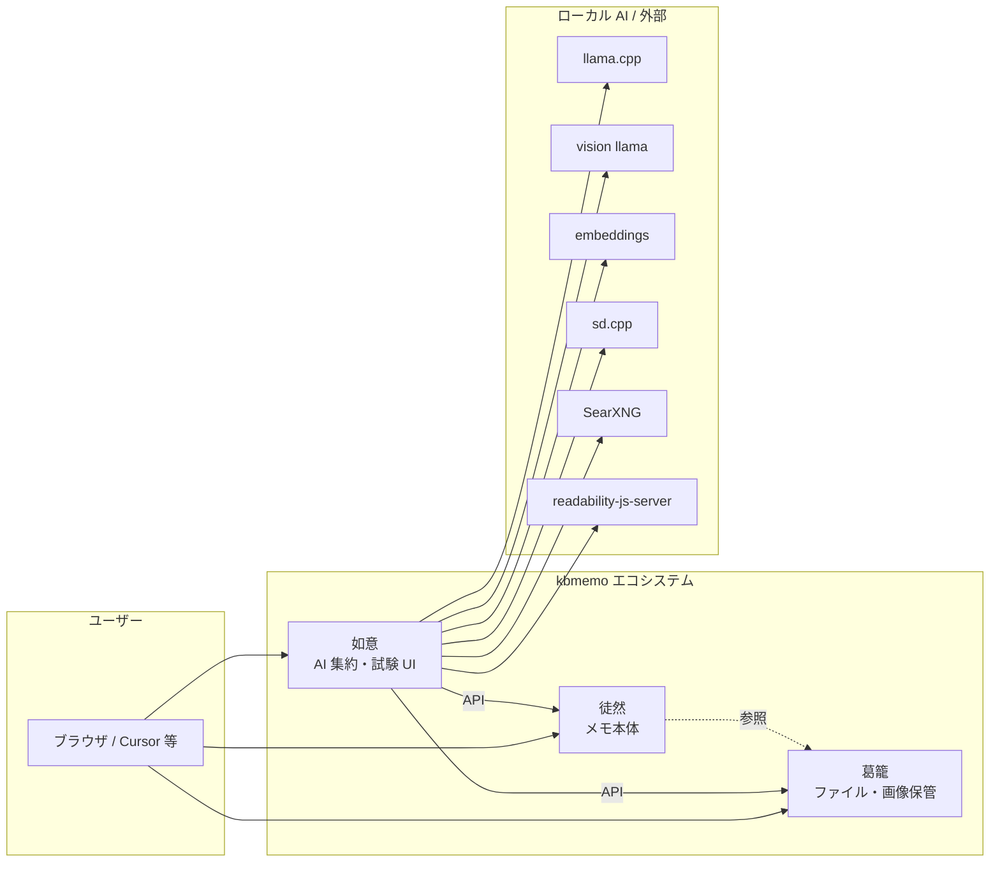
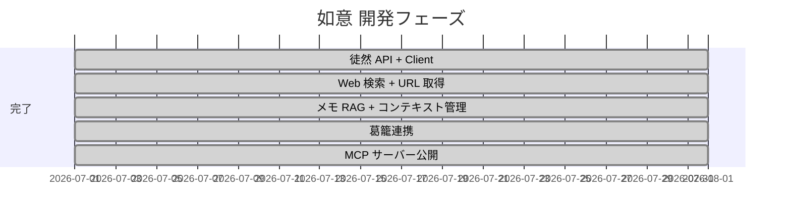

# kbmemo エコシステム — 現状・方針・ロードマップ

徒然（メモ）・葛籠（ファイル保管）・如意（AI 集約）の 3 アプリ構成と、如意を MCP サーバーとしても活用する方針を整理する。

---

## 1. 全体構成

| アプリ | URL（想定） | 読み / コード名 | 役割 |
|--------|-------------|----------------|------|
| **徒然** | kbmemo.net | tsuredure / `Tsurezure` | メモの正本。作成・編集・閲覧・検索 |
| **葛籠** | media.kbmemo.net（現行） | tsuzura | ファイル・画像の保管庫。バイナリの正本 |
| **如意** | nyoy.kbmemo.net | nyoy | AI 機能の集約、各機能の試験 UI、将来は MCP サーバー |

- 徒然リポジトリ: [gitea.artif.org/Artif.org/kbmemo_site](https://gitea.artif.org/Artif.org/kbmemo_site)（ローカル `~/work/kbmemo/site`）
- 葛籠は同一モノレポ内の `kbmemo-media/`。本番は現状 `media.kbmemo.net`
- **別 Workspace 開発:** 徒然は `site`、如意は `nyoy`。連携は **HTTP API 契約**（`docs/openapi/kbmemo-v1.yaml`）が正本。マルチルート Workspace に両方を追加すると Agent が横断参照しやすい

ローマ字表記の詳細は [徒然 API 要件 §0](./tsuredure-api-requirements.md#0-名称ローマ字表記) を参照。



### 設計原則

1. **正本の分離** — メモは徒然、バイナリは葛籠。如意は AI 処理とオーケストレーションに専念する。
2. **ツール層の共有** — Chat ツールと MCP ツールは同じ実装を使い回す。
3. **接続の一元管理** — 外部 AI サービスは `ServiceConnection` + `NyoyConnectionStore` 経由。
4. **試験 UI を如意に置く** — 画像生成・Chat など各 AI 機能は如意で先に試し、成熟したら他アプリや MCP から呼ぶ。
5. **API 契約で疎結合** — 徒然の検索エンジン（LIKE → Groonga 等）を差し替えても、HTTP 形状を維持すれば如意側は変更不要。

---

## 2. 如意（Nyoy）の現状

### 2.1 概要

日本語テキストから Stable Diffusion 画像を生成する Rails 8.1 アプリ。  
llama.cpp で `style_id` ベースの最小 JSON 計画を作成し、`SdPromptStyleResolver` で実行設定を解決して sd.cpp で txt2img を実行する。

**スタック:** Rails 8.1, PostgreSQL + pgvector, Neighbor, Solid Queue/Cache/Cable, Hotwire, Slim, Vite, `ruby_llm` gem。

### 2.2 機能一覧

| 機能 | ルート / モデル | 状態 |
|------|----------------|------|
| メモ挿絵 | `memo_illustrations` | 運用中 |
| 画像生成（draft → 選択 → refine） | `image_generations` | 運用中 |
| img2img | `img2img_generations` | 運用中 |
| 部分修正（inpaint） | `memo_illustrations#inpaint` | 運用中 |
| 画像理解 | `image_understandings` + `VisionChatService` | 運用中（独立 UI） |
| プロンプトナレッジ CRUD | `prompt_knowledge_chunks` | 運用中 |
| Chat | `chats` / `messages` | **運用中** |
| 接続管理 | `service_connections` | 運用中 |
| 徒然連携 | `TsurezureClient` + `ChatTools::*` | **運用中**（本番確認済み） |
| Web 検索 / URL 取得 | `web_search` / `fetch_url` | **実装済み** |
| メモ RAG | export 取込 + pgvector + `recall_memos`（既定）/ 自動注入 | **実装済み** |
| MCP サーバー | `/mcp` + `bin/mcp-stdio` | **運用中**（Chat / Graph / SD ツール公開） |
| 葛籠連携 | `TsuzuraClient` + Chat アーカイブ + メディアツール | **Phase 5a 完了** |

### 2.3 接続管理（ServiceConnection）

組み込みバックエンド **9 種** を DB で管理。環境変数へのフォールバックあり。

| key | 用途 |
|-----|------|
| `llama_cpp` | テキスト LLM（style 計画等） |
| `gpt_oss` | テキスト LLM（GPT-OSS 系、Chat） |
| `vision_llama` | 画像理解 |
| `embeddings` | bge-m3 埋め込み |
| `sd_cpp` | sd.cpp 画像生成 |
| `sd_switchd` | SD モデル切り替え |
| `kbmemo` | **徒然 API**（メモツール・RAG 取込） |
| `searfront` | **searfront**（`web_search`） |
| `readability` | **readability-js-server**（`fetch_url` 本文抽出） |

Chat バックエンド保存時に `ChatModelCatalog.seed!` で `Model` レコードを同期する。

### 2.4 Chat

- `ruby_llm` の `acts_as_chat` / `acts_as_message` / `acts_as_model`
- `ChatResponseJob` が `chat.complete` を実行し、Turbo Stream で Markdown 再レンダリング
- `ChatModelCatalog.context_for` で llama.cpp OpenAI 互換 API に接続
- **`ChatTools::Registry`** — 接続状態と `MainLlmToolPolicy` に応じてツールを動的配線
- **コンテキスト制御** — `ChatContextBuilder`（ターン制限 + 要約キャッシュ）、`ChatContextBudget`（トークン予算）、UI で推定 tokens・メモ RAG チャンク数
- **高速化** — prompt cache / sticky slot、要約・RAG を最新ユーザーメッセージへ、`recall_memos` ツール化（既定）、TTFT 計測。詳細は [Chat 高速化](./chat-performance.md)

| ツール | 用途 | 条件 |
|--------|------|------|
| `recall_memos` | メモ意味検索（ハイブリッド RAG） | `kbmemo` かつ `MEMO_RAG_MODE=tool` |
| `search_memos` | 徒然キーワード検索 | `kbmemo` |
| `get_memo` | 徒然メモ本文取得 | `kbmemo` |
| `create_memo` / `update_memo` | メモ write（通常 Chat では既定で非公開、MemoWrite/MemoUpdate Graph・MCP 側で扱う） | `kbmemo` |
| `web_search` | Web 検索 | `searfront` |
| `fetch_url` | URL 本文取得 | 常時（readability 優先、未設定時は直接取得） |

**メモ RAG:** 既定は `MEMO_RAG_MODE=tool`（モデルが必要時に `recall_memos`）。`inject` にすると毎ターンハイブリッド RAG を最新ユーザーメッセージへ自動注入。`get_memo` は全文が必要なときの補助。

**メインLLMのツール制限:** 通常 Chat は `MAIN_LLM_TOOL_MODE=restricted` を既定とし、読み取り系ツールだけを渡す。`create_memo` / `update_memo` / `apply_sampling_preset` は `all` または `MAIN_LLM_TOOL_ALLOWLIST` で明示した場合だけメインLLMに公開する。MCP は `scope: :mcp` で従来どおり別公開する。

実装: `app/services/chat_tools/`, `app/services/tsurezure_client.rb`, `app/services/memo_knowledge_*`, `app/services/chat_memo_rag_injector.rb`

### 2.5 RAG

| source | 用途 | 検索 |
|--------|------|------|
| `prompt`（既定） | 画風・LoRA・inpaint 等 | `PromptKnowledgeRetriever` |
| `memo` | 徒然メモチャンク | `MemoKnowledgeRetriever` + `recall_memos` / 自動注入 |

- `PromptKnowledgeChunk` — pgvector + `neighbor`、HNSW index
- 取込: `GET /api/v1/memos/export` → `MemoKnowledgeIngestJob` / `bin/rails kbmemo:rag:ingest`
- checkpoint: `AppSetting.memo_knowledge_last_ingested_at`。初回は全件 export 後に stale chunk を reconcile、以後は checkpoint 差分。
- 削除同期: `GET /api/v1/memos/export/deletions` → 該当 `memo_uid` の chunk を削除
- チャンク ID: `kbmemo:{uid}:chunk:{n}`（`external_id` 列）

### 2.6 外部連携の現状

| 連携先 | 状態 |
|--------|------|
| llama.cpp / sd.cpp / embeddings | HTTP（ServiceConnection 経由） |
| **徒然（kbmemo.net）** | **`/api/v1` 接続済み** |
| **SearXNG** | **接続済み**（`web_search`） |
| **readability-js-server** | **接続済み**（`fetch_url`） |
| 葛籠（media.kbmemo.net） | `TsuzuraClient` + Chat ツール + 生成メモ保存 | **Phase 5 完了** |
| MCP | **HTTP + stdio**（`ChatTools::*` 再公開、[mcp-server.md](./mcp-server.md)） |

---

## 3. 今後の方針

### 3.1 如意の位置づけ

- **AI ハブ** — ローカル LLM / SD / embeddings / 検索を束ね、徒然・葛籠・MCP クライアントから利用可能にする
- **試験場** — 新 AI 機能は如意 UI で先に検証し、安定後にツール化・MCP 化
- **RAG 管理** — プロンプトナレッジ + 徒然メモチャンク。将来 URL / 葛籠文書も `source` で拡張

### 3.2 Chat — 残タスク

| 機能 | 概要 | 状態 |
|------|------|------|
| Web 検索 | SearXNG | **完了** |
| URL 取得 | SSRF + readability | **完了** |
| メモ RAG | export 取込 + `recall_memos` / 注入切替 | **完了**（Groonga は徒然側） |
| Chat 高速化（cache / 計測） | prompt cache・ツール化 RAG・TTFT | **完了**（検討案件は [chat-performance.md](./chat-performance.md)） |
| 画像理解 | Chat 添付 + `analyze_image` ツール | **完了** |
| MCP 公開 | `ChatTools::*` / Graph / SD ツールの再公開 | **完了**（HTTP `/mcp` + `bin/mcp-stdio`） |

### 3.3 徒然側（site Workspace）との連携

| 変更 | 如意 API 変更 | 備考 |
|------|--------------|------|
| Groonga 検索（`GET /memos?q=` 内部差し替え） | **不要** | 検索精度のみ向上 |
| `export/deletions` 実装 | 取込ジョブが削除同期可能に | **完了** |
| webhook 通知 | 将来リアルタイム re-embed | Nyoy 受信側実装済み。徒然 delivery 未実装（[Memo RAG Webhook](./architecture/memo-rag-webhook.md)） |

### 3.4 ツール層アーキテクチャ（目標）

```
Chat UI ──┐
          ├── ChatTools::* ── ServiceConnection / 徒然 API / 葛籠 API
MCP Server ┘
```

### 3.5 MCP サーバー

`Mcp::ToolBridge` が `ChatTools::*` を MCP ツールとして再公開。詳細は [mcp-server.md](./mcp-server.md)。

| ツール | 由来 | MCP |
|--------|------|-----|
| `web_search` / `fetch_url` / `search_fetched_page` | SearXNG / readability | **公開済** |
| `search_memos` / `get_memo` / `create_memo` / `update_memo` | 徒然 API | **公開済** |
| `recall_memos` | メモ RAG | **公開済** |
| `list_albums` / `get_media` | 葛籠 API | **公開済** |
| `analyze_image` | `VisionChatService` | **公開済** |
| `list_image_generation_options` / `generate_image` / `get_image_generation` / `refine_image` | SD パイプライン | **公開済**（draft → refine / direct txt2img） |
| `run_research_graph` / `get_research_graph` / `retry_research_graph` | Research Graph | **公開済** |
| `run_image_understanding_graph` / `get_image_understanding_graph` / `retry_image_understanding_graph` | ImageUnderstanding Graph | **公開済** |
| `run_memo_write_graph` / `get_memo_write_graph` / `resume_memo_write_graph` | MemoWrite Graph | **公開済** |
| `run_memo_update_graph` / `get_memo_update_graph` / `resume_memo_update_graph` | MemoUpdate Graph | **公開済** |

---

## 4. 段階的ロードマップ

| Phase | 内容 | 状態 |
|-------|------|------|
| **0** | 徒然 API 要件整理 | **完了** |
| **0b** | OpenAPI 草案 | **完了** |
| **4a** | 徒然 `/api/v1` 実装 | **完了** |
| **4b** | 如意 Client + Chat メモツール | **完了** |
| **1** | Web 検索 + URL 取得 | **完了** |
| **3a** | メモ RAG 取込 + Chat 注入 | **完了** |
| **3b** | 動的 top_k・キーワード併用・チャンク圧縮 | **完了** |
| **3b′** | 徒然 PGroonga 検索（site DB） | **本番稼働**（git sync のみ残） |
| **3c** | 会話要約・トークン警告 UI | **完了** |
| **3d** | 要約キャッシュ・トークン予算・RAG ステータス | **完了** |
| **2** | Chat への画像理解統合 | **完了** |
| **5** | 葛籠連携 | **完了**（Client + Chat + 生成メモ保存 + Bearer バイナリ GET） |
| **6** | MCP サーバー公開 | **完了**（HTTP + stdio、Chat/SD ツール。構成は link:architecture/nyoy-mcp.adoc[nyoy-mcp.adoc]） |



---

## 5. 未決事項

| # | 論点 | 影響 | 備考 |
|---|------|------|------|
| 1 | ~~徒然 API 認証~~ | — | **決定:** 当面 `clip_api_token` 流用 |
| 2 | 葛籠への画像移行タイミング | 生成物の保管 | |
| 3 | ~~メモ RAG 削除同期~~ | 鮮度 | **完了** |
| 4 | ~~徒然 Groonga 検索~~ | キーワード RAG 精度 | **決定:** PGroonga（徒然 DB）。[実装手順](./tsuredure-pgroonga-search.md) |
| 5 | MCP 利用者 | 認可設計 | 個人利用のため当面は API キー 1 本 |
| 6 | マルチ Workspace 開発 | site + nyoy | OpenAPI 契約 + マルチルート推奨 |
| 7 | Chat `reasoning_effort` 等 | 体感レイテンシ | 生成側が支配的。[検討案件](./chat-performance.md#4-検討案件未着手) |

---

## 6. 次の作業

### 推奨

- webhook によるメモ RAG リアルタイム re-embed の徒然 delivery 実装（現状は checkpoint 定期同期で運用可能）

### 完了（Phase 6）

- HTTP `/mcp`（Streamable HTTP、Bearer 認証）
- `bin/mcp-stdio`（stdio トランスポート）
- `Mcp::ToolBridge` による `ChatTools::*` 再公開
- `Mcp::ExtensionTools`（`list_image_generation_options` / `generate_image` / `get_image_generation` / `refine_image`。`list_prompt_styles` は既存クライアント互換のため公開継続する非推奨ツール）
- Graph MCP tools（Research / ImageUnderstanding / MemoWrite / MemoUpdate）
- 本番 `MCP_API_TOKEN`（`config/deploy.yml` `env.secret`）
- Cursor / MCP 接続確認（`bin/mcp-list-tools`、stdio JSON-RPC、HTTP `/mcp`）

### 完了（Phase 5）

- 葛籠 Client + Chat メディアツール + 添付アーカイブ
- 生成画像の徒然メモ保存（明示保存のみ）
- Bearer 認証バイナリ GET（`/v1/media/:id/file`）

### 完了（Phase 2）

- Chat メッセージへの画像添付
- `VisionChatService` を `analyze_image` ツール化

### 次期 Agent Graph

- ImageUnderstanding Graph — Chat 添付経路、MCP tools、独立 UI Graph 化、`tsuzura_media_id` MCP 経路、retry 表示確認は実装済み。独立 UI / Chat 添付 / vision 障害 retry は development 実機で確認済み（`docs/image-understanding-graph-runbook.md` 確認ログ）。

### 運用・メンテ

```bash
# メモ RAG 初回 / 差分取込
bin/rails kbmemo:rag:ingest
UPDATED_SINCE=2026-07-01T00:00:00Z bin/rails kbmemo:rag:ingest
```

- Chat 画面で推定 tokens・メモ RAG チャンク数を確認
- 初回全件取込では export に存在しない stale chunk を削除し、以後は checkpoint から徒然 `export/deletions` も読んで削除済みメモの RAG chunk を同期削除

### 徒然（site）側

- **Agent Chat 画像仕上げ（refine）** — **完了**。ラフ案表示、ドラフト選択、`refine_image`〜`completed` polling、完成画像 URL の会話履歴 metadata 永続化まで接続済み（徒然 `chat-agent-roadmap.adoc` §12）
- **如意 パラメータ指定タブ** — SD モデル直選・生成テンプレート CRUD・JSON プロンプト生成・直接生成フロー・MCP direct 生成 — [設計書](./architecture/parameter-tab-image-generation.md)（如意側 Phase 5 まで完了）
- API 書込 `body_format: markdown` → AsciiDoc 変換 — **完了**（site 実装、Pandoc 確認、如意 `TsurezureClient` 経路の smoke 確認済み）
- PGroonga 全文検索（`Memo.search_text` 差し替え — **インストール OK**、[手順](./tsuredure-pgroonga-search.md)）
- `export/deletions` エンドポイント — **完了**

---

## 7. 関連ドキュメント

- [徒然（tsuredure）API 要件](./tsuredure-api-requirements.md)
- [徒然 API OpenAPI 草案](./openapi/kbmemo-v1.yaml)
- [徒然リポジトリ](https://gitea.artif.org/Artif.org/kbmemo_site)
- [プロンプト設計 再構築案](./prompt-architecture-redesign.md)
- [徒然 PGroonga 検索](./tsuredure-pgroonga-search.md)
- [Nyoy MCP アーキテクチャ](./architecture/nyoy-mcp.adoc)
- [Agent Graph Image Understanding](./architecture/agent-graph-image-understanding.md)
- [Memo RAG Webhook 設計](./architecture/memo-rag-webhook.md)
- [パラメータ指定タブ画像生成設計](./architecture/parameter-tab-image-generation.md)
- [Nyoy MCP 運用](./mcp-server.md)
- [README](../README.md)
