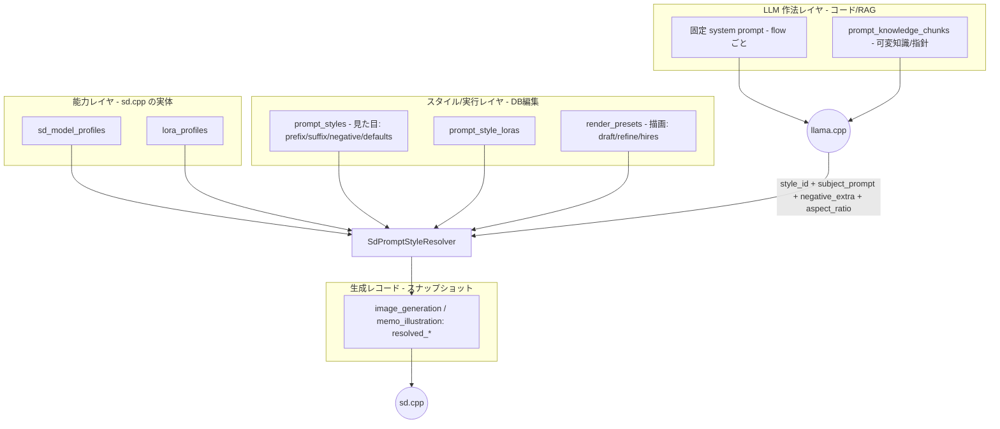
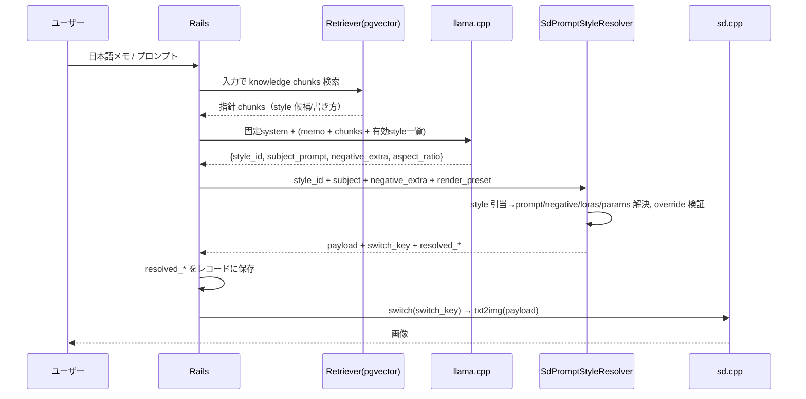

# プロンプト設計 再構築案

スキル / ナレッジ / LoRA辞書 / テンプレ / 生成プリセットの役割が重複・混乱してきたため、
**「スキル」を中心とした現行構成を捨て、`style_id` を軸にした構成へ再構築する**ための設計案。

- 対象: `PromptSkill`, `PromptKnowledgeChunk`, `PromptLora`, `PromptPreset`, `GenerationPreset`
- 関連サービス: `SdPromptPlanner`, `PromptSpecGenerator`, `PromptRagContext`, `NegativePromptResolver`
- 2つの利用フロー: **メモ挿絵** (`MemoIllustration`) / **画像生成** (`ImageGeneration`)

---

## 1. 現状の問題: 役割が重複している

| 概念 (モデル) | 本来の役割 | 実際に持っている責務 | 重複・混乱点 |
|---|---|---|---|
| スキル `PromptSkill` | LLM 作法 (system prompt) | `body`（作法）+ `default_negative_prompt`（実行時固定ネガ）+ default 旗 | **作法と実行設定が同居**。json_plan/translate を `body LIKE '%"positive"%'` で暗黙判別 |
| ナレッジ `PromptKnowledgeChunk` | RAG 用可変知識 | title/body/kind + embedding | テンプレと「指針 vs 固定 tag」の境界が曖昧 |
| LoRA辞書 `PromptLora` | LoRA 定義 | name/path/trigger/weight + `to_rag_context` + `to_lora_entry` | **RAG 文脈用と実行用を兼任** |
| テンプレ `PromptPreset` | （RAG 文脈用テンプレ） | positive/negative template + default_params | **ナレッジと役割が重複**。RAG 文脈にしか使われない |
| 生成プリセット `GenerationPreset` | 実行設定の束 | model/解像度/LoRA/sampler/skill/固定ネガ + draft/refine/hires | **「見た目」と「描画パイプライン」が同居**。固定ネガが skill と二重 |

### 核心的な混乱

1. **「固定ネガティブ」が 3 箇所に分散** — `PromptSkill.default_negative_prompt`、`GenerationPreset.default_negative_prompt`、`PromptPreset.negative_template`。`NegativePromptResolver` で都度マージしている。
2. **「画風・positive の素」が 4 箇所に分散** — skill body、preset template、knowledge body、generation の prompt。
3. **LLM の自由度が広すぎる** — `SdPromptPlanner` / `PromptSpecGenerator` は LLM に positive/negative だけでなく width/height/steps/cfg/model/LoRA まで生成させている。ローカル LLM の揺れがそのまま実行設定に漏れる。
4. **「見た目(style)」と「描画(pipeline)」が分離していない** — `GenerationPreset` が解像度・sampler（見た目寄り）と draft/refine/hires（パイプライン）を同時に持つ。

---

## 2. 設計原則

1. **`style_id` を検索キー、実行設定は DB が持つ。** LLM には model path / LoRA path / port / steps を生成させない。
2. **LLM 出力は最小 JSON に固定する。** `style_id` + `subject_prompt` + `negative_extra` + `aspect_ratio` のみ。
3. **「作法」はコード化、「可変知識」はナレッジ(RAG)へ。** 編集可能な per-record system prompt（＝スキル）を廃止。
4. **固定ネガティブは 1 箇所（style）に集約する。**
5. **「見た目(style)」と「描画パイプライン(render)」を分離する。**
6. **生成レコードに解決済みスナップショットを保存し、後から再現できるようにする。**

---

## 3. 目標アーキテクチャ

4 レイヤに整理する。



### レイヤと責務

| レイヤ | テーブル / 置き場所 | 責務 | 編集者 |
|---|---|---|---|
| 能力 | `sd_model_profiles` | sd.cpp で起動可能なモデル定義（switch_key, family, default_params） | 管理者 |
| 能力 | `lora_profiles` | sd.cpp で使える LoRA 定義（path, trigger, weight 範囲） | 管理者 |
| スタイル | `prompt_styles` | **見た目**: prompt_prefix/suffix、固定 negative、generation_defaults、allowed_overrides、参照モデル | 管理者 |
| スタイル | `prompt_style_loras` | style ↔ lora の対応と multiplier | 管理者 |
| 描画 | `render_presets` | **パイプライン**: draft(batch/steps) / refine(denoise/hires) | 管理者 |
| 知識 | `prompt_knowledge_chunks` | **どの style_id を選ぶか / subject_prompt に何を書くか**の指針（固定 tag のコピー源ではない） | 運用者 |
| 作法 | コード（flow ごとの固定 system prompt） | 最小 JSON 契約を守らせる指示 | 開発者 |
| 記録 | `image_generation` / `memo_illustration` の `resolved_*` | 実行時スナップショット（再現用） | システム |

> **「スキル」は廃止。** その責務は (a) 固定 system prompt = コード、(b) 可変な書き方の指針 = ナレッジ、(c) 固定ネガティブ = style に分解される。

---

## 4. テーブル定義案

### 4.1 `sd_model_profiles`（能力）

```ruby
create_table :sd_model_profiles do |t|
  t.string  :key, null: false            # 内部キー
  t.string  :name, null: false           # 表示名
  t.string  :family, null: false         # sd15 / sdxl / pony / illustrious / sd35 / flux
  t.string  :switch_key, null: false     # switchd に渡す名前
  t.string  :base_url                     # ポート運用時のみ（切替式は nil）
  t.jsonb   :default_params, null: false, default: {}
  t.boolean :enabled, null: false, default: true
  t.text    :notes
  t.timestamps
end
add_index :sd_model_profiles, :key, unique: true
```

### 4.2 `lora_profiles`（能力）

`PromptLora` を置き換え。**RAG 文脈用の文字列化は別 presenter に逃がし、モデル自体は定義のみ持つ。**

```ruby
create_table :lora_profiles do |t|
  t.string  :key, null: false
  t.string  :name, null: false
  t.string  :family
  t.string  :path, null: false           # /sdapi/v1/loras に出る相対 path
  t.string  :trigger_words, array: true, default: []
  t.decimal :default_multiplier, precision: 4, scale: 2, null: false, default: 0.7
  t.decimal :min_multiplier, precision: 4, scale: 2, null: false, default: 0.0
  t.decimal :max_multiplier, precision: 4, scale: 2, null: false, default: 1.5
  t.boolean :enabled, null: false, default: true
  t.text    :notes
  t.timestamps
end
add_index :lora_profiles, :key, unique: true
add_index :lora_profiles, :path, unique: true
```

### 4.3 `prompt_styles`（見た目の中心）

`PromptPreset`（テンプレ）と `GenerationPreset` の見た目部分、`PromptSkill.default_negative_prompt` を統合。
**1 style が複数モデルを選べる**ようにするため、モデルは join (`prompt_style_models`) で持つ（`§4.4`）。

```ruby
create_table :prompt_styles do |t|
  t.string     :style_id, null: false        # LLM が選ぶキー
  t.string     :name, null: false
  t.text       :description
  t.text       :prompt_prefix, null: false    # 画風 positive の固定部
  t.text       :prompt_suffix
  t.text       :negative_prompt, null: false  # 固定ネガティブ（唯一の置き場）
  t.jsonb      :generation_defaults, null: false, default: {}  # width/height/steps/cfg/sampler...
  t.jsonb      :allowed_overrides, null: false, default: {}    # UI/LLM から変更可能な範囲
  t.jsonb      :aspect_presets, null: false, default: {}       # square/portrait/landscape -> w,h
  t.jsonb      :aliases, null: false, default: []              # RAG 用の別名
  t.boolean    :enabled, null: false, default: true
  t.integer    :sort_order, null: false, default: 0
  t.timestamps
end
add_index :prompt_styles, :style_id, unique: true
```

### 4.4 `prompt_style_models`（style ↔ model join）

1 style に複数のモデルを紐付け、うち 1 つを既定にする。**モデルの最終選択は LLM に任せず**、既定 or UI/override で決める（`§7`）。

```ruby
create_table :prompt_style_models do |t|
  t.references :prompt_style, null: false, foreign_key: true
  t.references :sd_model_profile, null: false, foreign_key: true
  t.boolean    :default, null: false, default: false   # style 内の既定モデル
  t.jsonb      :param_overrides, null: false, default: {}  # モデル別の上書き（任意）
  t.integer    :sort_order, null: false, default: 0
  t.timestamps
end
add_index :prompt_style_models, [:prompt_style_id, :sd_model_profile_id], unique: true
```

> 既定モデルは style ごとに 1 つ。`prompt_styles` 保存時に「default が 1 件」を担保する。

### 4.5 `prompt_style_loras`（join）

```ruby
create_table :prompt_style_loras do |t|
  t.references :prompt_style, null: false, foreign_key: true
  t.references :lora_profile, null: false, foreign_key: true
  t.decimal    :multiplier, precision: 4, scale: 2, null: false, default: 0.7
  t.boolean    :required, null: false, default: false
  t.boolean    :inject_trigger_words, null: false, default: true
  t.integer    :sort_order, null: false, default: 0
  t.timestamps
end
add_index :prompt_style_loras, [:prompt_style_id, :lora_profile_id], unique: true
```

### 4.6 `render_presets`（描画パイプライン）

`GenerationPreset` の draft/refine/hires 部分を style から分離。**style に依存しない**ので、どの style にも組み合わせられる。
`kind` で 1 テーブルに集約する（別テーブルには分けない）。**メモ挿絵用に `single`（単発描画）を追加**する。

```ruby
create_table :render_presets do |t|
  t.string  :name, null: false
  t.string  :kind, null: false          # single / draft / refine
  t.boolean :default, null: false, default: false
  # single / draft 共通
  t.integer :draft_batch_size           # single は 1 固定運用
  t.integer :draft_steps
  # refine
  t.integer :refine_steps
  t.decimal :refine_denoising_strength, precision: 4, scale: 3
  t.boolean :enable_hires, default: false
  t.string  :hires_upscaler
  t.decimal :hires_scale, precision: 4, scale: 2
  t.integer :hires_steps
  t.decimal :hires_denoising_strength, precision: 4, scale: 3
  t.timestamps
end
```

- `single`: メモ挿絵の単発生成（batch=1、案選択・refine なし）。
- `draft`: 画像生成の案出し（複数 batch）。
- `refine`: 案選択後の仕上げ（+hires）。

### 4.7 `prompt_knowledge_chunks` の `style_ref`

`kind = "style"` の chunk を `style_id` への明示参照にする（自由テキストの指針だけに頼らない）。
これにより「この画風メモ → この style_id」を RAG が確実に橋渡しできる。

```ruby
add_column :prompt_knowledge_chunks, :style_ref, :string  # prompt_styles.style_id を指す（kind=style 時）
add_index  :prompt_knowledge_chunks, :style_ref
```

> `kind=style` の chunk は `style_ref` 必須。それ以外の kind（lora/negative/composition…）は従来どおり指針テキスト。

### 4.8 生成レコードのスナップショット列

`image_generation` / `memo_illustration` に追加（再現性のため、設定変更後も過去画像の生成条件を保持）。

```ruby
add_column :image_generations, :style_id, :string
add_column :image_generations, :resolved_prompt, :text
add_column :image_generations, :resolved_negative_prompt, :text
add_column :image_generations, :resolved_model_key, :string
add_column :image_generations, :resolved_loras, :jsonb, default: []
add_column :image_generations, :resolved_params, :jsonb, default: {}
# memo_illustrations も同様
```

---

## 5. LLM 契約（最小 JSON）

flow ごとに**固定の** system prompt をコードに置く（per-record 編集はしない）。可変な指針は RAG で渡す。

出力は両 flow 共通で最小:

```json
{
  "style_id": "pencil_still_life_sketch",
  "subject_prompt": "a ceramic cup, a small apple, a folded cloth on a quiet desk",
  "negative_extra": "busy composition, hard shadows",
  "aspect_ratio": "square"
}
```

Rails 側で**無視する**（LLM に出させても捨てる）もの:

```text
model_path / lora_path / server_url / port / steps / cfg / 絶対パス / system command
```

JSON Schema (`response_format`) は `style_id` を enum（有効な `prompt_styles.style_id`）、`aspect_ratio` を enum（`square`/`portrait`/`landscape`）に制約する。
→ 既存の `MemoPromptPlanJsonSchema` / `PromptSpecJsonSchema` をこの契約に差し替える。

---

## 6. データフロー（再構築後）

**両 flow でプロンプト構築経路は同一**。違いは描画パイプライン（render_preset）だけ。



- **メモ挿絵**: `render_preset.kind = single`（単発描画、案選択・refine なし）。
- **画像生成**: `render_preset.kind = draft` → 案選択 → `render_preset.kind = refine (+hires)`。

width/height/steps/cfg/sampler は **style.generation_defaults** から来る。LLM の `aspect_ratio` は `style.aspect_presets` で w,h に変換。LLM は数値を直接決めない。

---

## 7. Resolver サービス

```ruby
class SdPromptStyleResolver
  class Error < StandardError; end

  def initialize(style_id:, subject_prompt:, negative_extra: nil, aspect_ratio: nil,
                 model_key: nil, overrides: {})
    # model_key は UI/override 用。未指定なら style の既定モデルを使う。
  end

  def call
    style = PromptStyle.includes(prompt_style_models: :sd_model_profile,
                                 prompt_style_loras: :lora_profile)
                       .find_by!(style_id: @style_id, enabled: true)
    style_model = pick_style_model(style, @model_key)   # 既定 or 許可された override のみ
    model = style_model.sd_model_profile

    params = model.default_params
                  .deep_merge(style_model.param_overrides)
                  .deep_merge(style.generation_defaults)
                  .deep_merge(aspect_params(style, @aspect_ratio))
                  .deep_merge(safe_overrides(style, @overrides))

    prompt   = [style.prompt_prefix, @subject_prompt, trigger_words(style), style.prompt_suffix]
                 .compact_blank.join(", ")
    negative = [style.negative_prompt, @negative_extra.presence].compact_blank.join(", ")
    loras    = resolve_loras(style)

    {
      style_id: style.style_id,
      switch_key: model.switch_key,
      base_url: model.base_url,
      resolved_model_key: model.key,
      resolved_prompt: prompt,
      resolved_negative_prompt: negative,
      resolved_loras: loras,
      resolved_params: params,
      payload: params.merge(prompt:, negative_prompt: negative, lora: loras)
    }
  end
end
```

- `pick_style_model` は `model_key` 未指定なら style の既定モデルを返す。指定時は **その style に紐づくモデルのみ**許可（未許可なら既定にフォールバック or エラー）。**LLM には model を選ばせない**（UI/明示 override のみ）。
- `safe_overrides` は `allowed_overrides`（配列 = 許可値 / `{min,max}` = clamp）でガード。
- `NegativePromptResolver` は **style.negative_prompt + negative_extra のマージのみ**に縮小（skill/preset の二重管理を解消）。

---

## 8. 旧 → 新 マッピング

| 旧 | 新 | 移行方針 |
|---|---|---|
| `PromptSkill.body` | flow ごとの固定 system prompt（コード）+ `prompt_knowledge_chunks` | 破棄。作法はコード化、可変指針はナレッジへ |
| `PromptSkill.default_negative_prompt` | `prompt_styles.negative_prompt` | style に集約 |
| `PromptSkill` json_plan/translate 区別 | flow（memo/free）+ style | body 判別を廃止 |
| `PromptPreset`（テンプレ） | `prompt_styles`（prefix/suffix/negative/defaults） | 統合 |
| `GenerationPreset` 見た目部分 | `prompt_styles` + `sd_model_profiles` | 統合 |
| `GenerationPreset` draft/refine/hires | `render_presets` | 分離 |
| `PromptLora` | `lora_profiles`（+ RAG presenter 分離） | リネーム＋整理 |
| `PromptKnowledgeChunk` | `prompt_knowledge_chunks`（役割明確化） | 維持。「指針のみ」に統一 |
| `ImageGeneration.loras/params/prompt` | `resolved_*` スナップショット | 解決結果を保存 |

---

## 9. 再構築の手順（フェーズ）

破壊的変更を伴うため、**新テーブルを先に立て、フローを切替えてから旧テーブルを落とす**順で進める。

- **Phase 0 — 合意**: 本ドキュメントのレビュー・確定。`§11` の決定事項を埋める。
- **Phase 1 — 能力レイヤ**: `sd_model_profiles` / `lora_profiles` を新設し seed。既存 `PromptLora` → `lora_profiles` へデータ移行。`SDCPP_DEFAULT_MODELS` を `sd_model_profiles` seed に置換。
- **Phase 2 — スタイルレイヤ**: `prompt_styles` / `prompt_style_loras` 新設。既存 `GenerationPreset` + `PromptPreset` + skill の固定ネガから style を起こす seed（例: 鳥獣戯画、鉛筆スケッチ）。
- **Phase 3 — 描画レイヤ**: `render_presets` 新設。`GenerationPreset` の draft/refine/hires を移管。
- **Phase 4 — LLM 契約**: `SdPromptStyleResolver` 実装。固定 system prompt をコード化。`MemoPromptPlanJsonSchema` / `PromptSpecJsonSchema` を `style_id` 契約へ差し替え。
- **Phase 5 — フロー切替**: `SdPromptPlanner` / `PromptSpecGenerator` を「最小 JSON → resolver」経由に書き換え。生成レコードに `resolved_*` 列追加＆保存。両 flow を新経路へ。
- **Phase 6 — 旧資産削除**: `PromptSkill` / `PromptPreset` / `GenerationPreset` / `PromptLora` とその UI・routes・seed・テストを削除。README の役割表を更新。

各 Phase 末で `bin/rails test` を通し、UI から 1 件ずつ生成して回帰確認する。

---

## 10. UI で編集できる項目（再構築後）

```text
PromptStyle:        name / description / enabled / prompt_prefix / prompt_suffix /
                    negative_prompt / generation_defaults / allowed_overrides /
                    aspect_presets / aliases / モデル(複数選択・既定指定) / LoRA(ON/OFF, multiplier)
SdModelProfile:     name / switch_key / family / base_url / default_params / enabled
LoraProfile:        name / path / trigger_words / multiplier 範囲 / enabled
RenderPreset:       name / kind(single/draft/refine) / 各パラメータ / default
KnowledgeChunk:     title / kind / body（指針）/ style_ref（kind=style 時は style_id 参照）
```

LoRA `path` を編集可能にする場合、保存前に `/sdapi/v1/loras` の結果と照合できると安全。

---

## 11. 決定事項（確定済み）

1. **メモ挿絵の描画**: 専用の single-phase `render_preset`（`kind = single`）を作る。`draft` の流用はしない。
2. **style と model の結合度**: style から**複数 model を選べる**。`prompt_style_models` join で持ち、style ごとに既定モデルを 1 つ指定。最終選択は既定 or UI/override（LLM には選ばせない）。
3. **`render_presets` の分割**: 別テーブルには分けず、`kind`（single/draft/refine）で 1 テーブルに集約する現案を採用。
4. **既存データの移行範囲**: 旧 `GenerationPreset` / `PromptPreset` は **seed で作り直すだけ**。本番 DB からの自動移行スクリプトは書かない。
5. **knowledge の kind**: `kind = style` の chunk は `style_ref`（`prompt_styles.style_id` への明示参照）を必須にする。他 kind は従来どおり指針テキスト。
6. **aspect_ratio の語彙**: `square` / `portrait` / `landscape` の 3 値で確定。

---

## 12. モデルファミリー (family) の扱い

`sd_model_profiles.family` / `lora_profiles.family` が表す「SD のアーキテクチャ系統」の設計方針。

### 語彙（コード所有の enum）

`SdModelProfile::FAMILIES` に定義する固定 enum で、CRUD 対象にしない。

```text
sd15 / sdxl / pony / illustrious / sd35 / flux
```

- 表示名は `SdModelProfile::FAMILY_LABELS`（例: `sd35` → "SD 3.5"）。
- `LoraProfile::FAMILIES` / `FAMILY_LABELS` は `SdModelProfile` の定義を再利用する。
- family は「技術タクソノミー（めったに増えない）」であり、増える時はコード側の検証も伴うため、**DB CRUD ではなくコード enum で管理する**。

### family が効く 2 箇所

1. **系統別 default_params** — `SdModelProfile::FAMILY_DEFAULT_PARAMS` が family ごとの生成パラメータ基準（width/height/steps/cfg_scale/sampler_name）を持つ。
   `SdModelProfile#resolved_default_params` は `family_default_params.deep_merge(default_params)` を返し、`SdPromptStyleResolver` はこれをパラメータ基底に使う。
   - つまり **family が既定値を供給し、個別モデルの `default_params` はそこからの逸脱分だけ**を持てばよい。
   - `PromptStyle#family` は既定モデルの family を返す。

2. **family 別 RAG ガイダンス** — `StylePlanPrompts::FAMILY_GUIDANCE` が family ごとの subject_prompt の書き方指針（タグ列挙系 vs 自然文系など）を持つ。
   `StylePlanGenerator` は各スタイル行に `[family]` を付与し、対象 family のガイダンスをプラン生成プロンプトへ注入する。SD 3.5 / Flux は自然文寄り、SDXL / Pony / Illustrious はタグ列挙寄り、といった差をここで吸収する。

### 設計判断: family の CRUD は持たない（現状維持）

- family 一覧・ガイダンスは「作法」寄りでコードに置く（`§2` の原則3と同じ思想）。
- 系統から外れたい個別モデルは `default_params` の上書きで対応できる逃げ道が既にある。
- UI 編集可能にすると誤設定で生成品質・作法を壊すリスクがあるため、当面 enum を維持する。
  将来どうしても運用中に系統別パラメータを触りたくなったら、`FAMILY_DEFAULT_PARAMS` のみを軽量に外部化する段階拡張に留める（一覧・ガイダンスはコードのまま）。

### 新しい family を追加する手順

コードの 3 箇所を更新するだけ。

1. `SdModelProfile::FAMILIES` に値を追加（表示順の位置に挿入）。
2. `SdModelProfile::FAMILY_LABELS` に表示名を追加。
3. `SdModelProfile::FAMILY_DEFAULT_PARAMS` に系統別の基準パラメータを追加。
4. （任意）`StylePlanPrompts::FAMILY_GUIDANCE` に書き方指針を追加。

既存モデルへ family 由来の既定を反映するだけなら full `db:seed` は不要で、能力レイヤのみ再 seed する:

```bash
bin/rails runner 'require_relative "lib/capability_seeds"; CapabilitySeeds.seed_models!'
```

> full `db:seed` は service_connections / prompt_styles / render_presets / チャットモデル / RAG チャンクも upsert 上書きするため、それらの UI 編集を巻き戻したくない場合は上記の限定 seed を使う。
